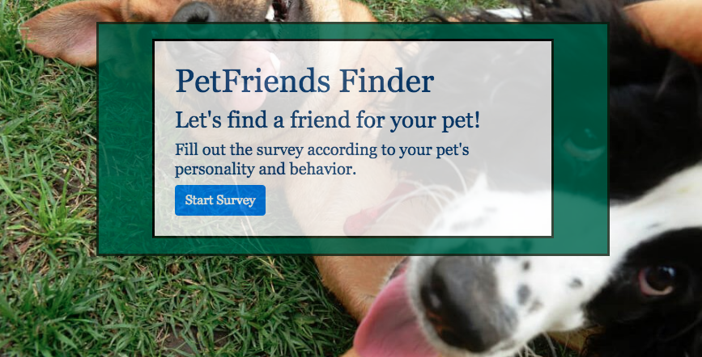

# PetFriendFinder

Project Description 

Lonely at the dog park? Need a play date with your pet? Or maybe your pet needs to learn to socialize?
This application will help find a pet that has similar behaviors and personality traits to yours. Take a survey to match your pet with others by comparing your entered score within the database of other pets' ratings. This will also add your pet to the list in the application, then hopefully you'll see if more matches come your way, too. We're here to help you and your pet find a friend.

[Click this link to start the survey on Heroku.](https://murmuring-hamlet-59011.herokuapp.com/)

Project Specifications

Backend - This is a Node.js based application deployed by Heroku.
Installed packages:
* Express and in use express.Router()
* Path

Front End - HTML with Bootstrap, Javascript, and CSS styling

[Jennifer Alejos Website](https://www.jenalejos.com/)

